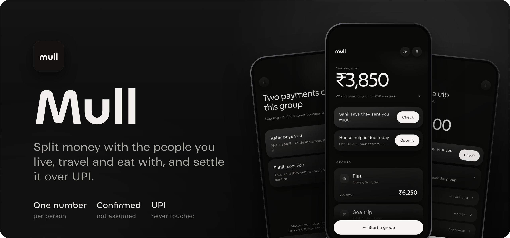
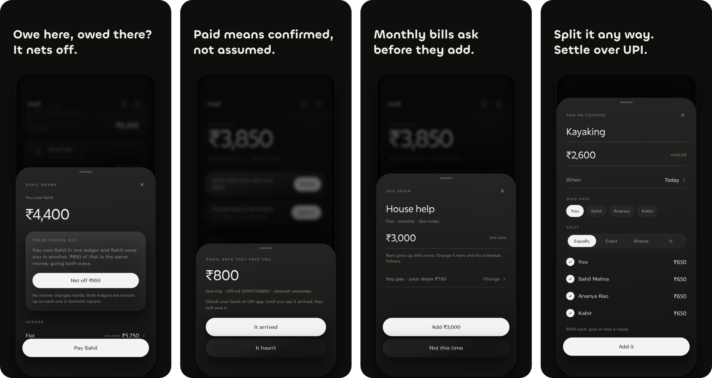

<p align="center">
  
</p>

<div align="center">


[](LICENSE)

**Split money with the people you live, travel and eat with, and settle it over UPI.**<br>
<sub>iOS app · Flutter · Supabase · India</sub>

[Overview](#overview) · [Highlights](#highlights) · [How it works](#how-it-works) · [Getting started](#getting-started) · [Status](#status-and-roadmap) · [Website](https://mull.oblunestudio.com)

</div>

<p align="center">
  
</p>

<!--
  Launch film: drag films/output/mull-feature-preview.mp4 (12 MB; trim or compress under 10 MB on a free plan)
  into any GitHub comment box, copy the https://github.com/user-attachments/assets/... link it gives you,
  and paste it on its own line between the two blank lines below. GitHub turns it into a player.
-->

> [!IMPORTANT]
> **Source-available, not open source.** This repository is public so it can be read as a portfolio piece and a reference. It may not be copied, reused or republished. See [LICENSE](LICENSE).

## Overview

Mull tracks shared money with the people you live, travel and eat with: who paid, who owes, and the fewest payments that clear it. Groups cover a trip or a flat, one-to-one ledgers cover everything else, and schedules handle what comes round every month.

Payments happen over UPI, which Mull never touches. Tapping Pay opens your UPI app with the amount and the person already filled in.

## Highlights

| Feature | What it does |
|---|---|
| **One number per person** | Owe Ananya ₹2,000 on the trip while she owes you ₹3,000 on the flat? She owes you ₹1,000, and Mull can net the two ledgers off. |
| **Claimed, then confirmed** | The payer claims a payment and the payee confirms it arrived. No balance moves on a single unverified tap. |
| **Schedules that ask** | Rent and bills surface as a card with the amount ready to edit. What you confirm becomes the new normal. |
| **Local-first sync** | Edits land in a JSON file on the phone first, so it works on a train. Sync sends only what changed. |
| **Security in the database** | Row-level security on every table, and triggers freeze confirmed payments. A modified client gets nowhere. |
| **Private by construction** | Group-mates see a name and a UPI ID. Error reports are scrubbed of emails and ids. |

## How it works

The phone is the first source of truth. Supabase is where edits meet, and where the rules are enforced.

```text
 Flutter UI
     │  every edit applies locally first
     ▼
 MullStore ── mull.json on the phone, works offline
     │  push: only rows changed since the server's last ack
     │  pull: only groups whose revision moved
     ▼
 Supabase · Mumbai
 ├─ Postgres with row-level security on every table
 ├─ seats, not users: split with someone before they sign up
 └─ triggers ─┬─ freeze confirmed payments
              ├─ realtime: one private topic per user ──▶ other phones
              └─ edge function ──▶ APNs push
```

- **Only the person paid can confirm a payment.** Confirmed facts are frozen by database triggers.
- **UPI IDs come only from their owner's account**, because a typo in a payer-typed ID pays a stranger.
- **The anon key is public by design.** It ships in every copy of the app; row-level security protects the data.

<details>
<summary><strong>The design</strong></summary>

Built from `Mull UI spec.pdf` and the eight exported screens (4A–4H). Four rules carry it, and `lib/ui/tokens.dart` is where they live:

- **No colour, ever.** Owing and being owed are told apart by words and weight, never by hue. There is no accent and no red or green. Nothing recedes by going translucent either: a row that is done steps back by sitting flatter and by saying so.
- **No borders, no glass.** Hierarchy is only how high a surface floats: a gradient fill and a shadow. `Lift.focal` / `card` / `low` / `flat`, and exactly one focal object per screen.
- **Two gutters.** Text and titles at 30, cards and buttons at 20, so cards break outboard of the copy above them. `Gutter.text` and `Gutter.card`.
- **Numbers are Excon and always tabular; words are Ranade.** `MullType` names every role.

Dark is primary; the paper theme is an option in the profile sheet. There are no em dashes in anything the app shows you.

</details>

## Tech stack

| Layer | Tools |
|---|---|
| **Client** |    |
| **Backend** |     |
| **Delivery** |   |

## Getting started

**Requirements**

- Flutter SDK (Dart 3.13+)
- Xcode, and an iPhone or the iOS Simulator
- The typefaces are not in the repository (their licence does not allow it). The build scripts download them from Fontshare on first run, or run `./tool/fetch-fonts.sh`

### 1. Run with no account

```sh
flutter run
```

With no Supabase keys, groups stay on the phone and onboarding asks only for a name and a UPI ID. Debug builds also have **Load sample data** in the profile sheet.

### 2. Run against the live backend

```sh
./run-dev.sh            # live Supabase project
./run-dev.sh --sample   # seeded with the mockup data
./install-phone.sh      # release build, installed on a paired iPhone
```

### 3. Test

```sh
flutter test
```

Covers money, splitting, the ledger, schedules, reminders and persistence.

<details>
<summary><strong>Screen tours and build notes</strong></summary>

Walk every screen and write `screenshots/`:

```sh
flutter drive --driver=test_driver/integration_test.dart --target=integration_test/tour_test.dart
flutter drive --driver=test_driver/integration_test.dart --target=integration_test/onboarding_test.dart
```

A target that fails to compile makes `flutter drive` silently run the previous build, so check `flutter analyze` is clean before trusting a green run.

The project sits on an iCloud-synced Desktop. iCloud tags build output with Finder metadata that `codesign` rejects, so `build/` is a symlink to `~/Developer/.build-cache/mull`. If `build/` ever becomes a real folder again:

```sh
rm -rf build && mkdir -p ~/Developer/.build-cache/mull && ln -s ~/Developer/.build-cache/mull build
```

</details>

<details>
<summary><strong>Project structure</strong></summary>

```text
lib/
├─ core/      ₹ formatting, forgiving amounts (28k, 1.2L), recurrence maths,
│             splitting, debt simplification, UPI payment links
├─ data/      models and MullStore (local-first JSON); remote/ for Supabase sync
├─ ui/        design tokens, surfaces, sheets, page scaffold, icons
└─ screens/   onboarding, home, people sheet (people_sheet.dart),
              groups/ (create, hub, settle up, ledger, recurring)
```

</details>

## Status and roadmap

Version 1.0.0, prepared for its first App Store release in India.

- [x] Groups and one-to-one ledgers
- [x] Net-off across ledgers
- [x] Claim-and-confirm payments
- [x] Recurring schedules that ask
- [x] Push notifications through APNs
- [ ] App Store release

<details>
<summary><strong>Earlier versions</strong></summary>

- **Share extension.** Until 2026-09-21 a share extension read UPI receipts shared into Mull and filed them as evidence against a debt. It was switched off before TestFlight; the extension, the Vision OCR and `UpiReceiptReader` are at the `share-extension-era` tag.
- **Wishlist.** Mull used to be a budget-aware wishlist with groups bolted on. The wishlist, named lists and the budget-as-ruler are at the `wishlist-era` tag. A `mull.json` written by that version still opens: groups carry over untouched, and an expense flagged `repeatsMonthly` becomes a schedule.

</details>

## License

Source-available, not open source. See [LICENSE](LICENSE).

[Website](https://mull.oblunestudio.com) · [Privacy](https://mull.oblunestudio.com/privacy.html) · [Support](https://mull.oblunestudio.com/support.html)

---

<div align="center">
  <sub>Built by <a href="https://github.com/waterduckpani">Bharat Khanna</a> · <a href="https://github.com/waterduckpani?tab=repositories">More projects</a></sub>
</div>
