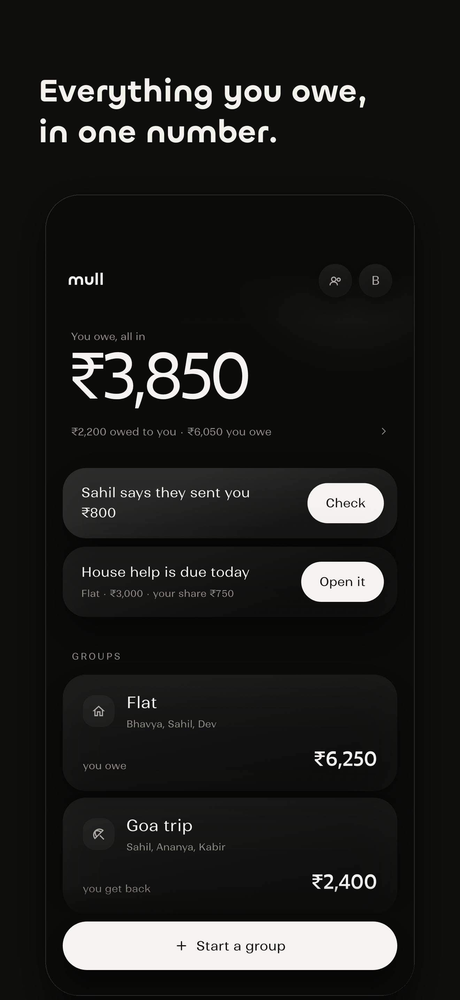
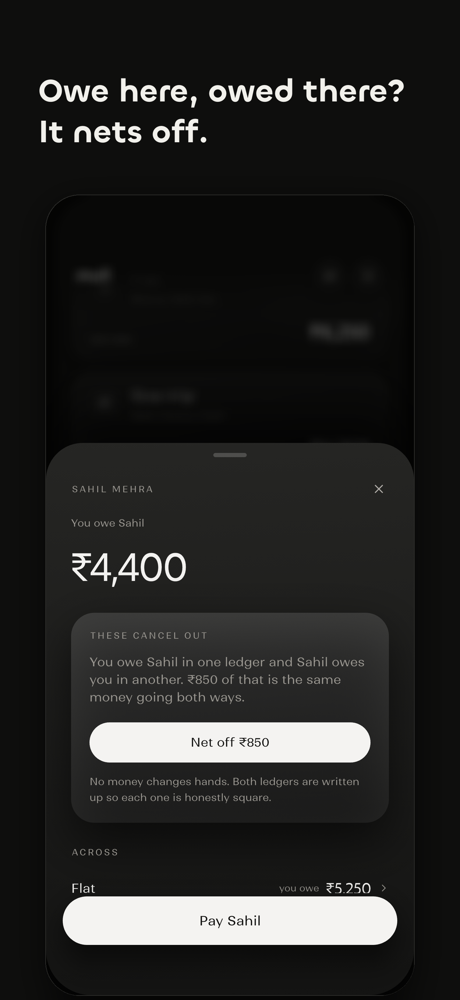
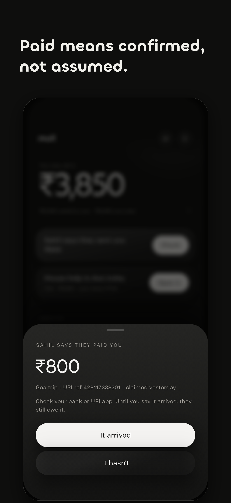

# Mull

**Split money with the people you live, travel and eat with, and settle it over UPI.**
An iOS app for India, built in Flutter on Supabase.

<p>
  
  
  
</p>

> **Source-available, not open source.** This repository is public so it can be read as a
> portfolio and a reference. It may not be copied, reused or republished. See [LICENSE](LICENSE).

Who paid, who owes, and the fewest payments that clear it, settled over UPI,
which Mull never touches. Groups for a trip or a flat, one-to-one ledgers for
everything that is not a group, and schedules for the things that come round
every month on their own.

The things it does that other split apps do not:

- **Money between two people is one number.** Owing Ananya ₹2,000 on the trip
  while she owes you ₹3,000 on the flat is one fact — she owes you ₹1,000 — and
  Mull says so, on the home screen and in the reminder it sends. Where debts
  point both ways it offers to **net them off**: both ledgers are written up so
  each is honestly square, and nothing moves. Every screen says which way it
  points, in words, in both directions.
- **A payment is claimed and then confirmed.** "Mark as settled" being a single
  unverified tap is what makes a shared ledger rot — one side taps it, the other
  never sees the money, and the balance is quietly wrong forever. Here the payer
  claims and the payee confirms. A claim nobody answered, and one that
  was disputed, both stay findable and fixable.
- **A schedule asks.** Rent goes up and people move out, so a due schedule
  surfaces as a card with the amount in an editable field. What you confirm is
  what gets recorded, and it becomes the new normal.


## How it is built

- **Flutter (iOS), local-first.** Every edit applies to a JSON file on the phone first and syncs
  afterwards, so the app works on a train with no signal. `MullStore` keeps a print of each row as
  the server last saw it (`Group.acked`), so a push sends only what changed and a pull never
  overwrites an edit that has not gone up yet.
- **Supabase in Mumbai.** Postgres with row-level security on every table: the database, not the
  app, decides who can read or change what, so a modified client gets nowhere. Seats rather than
  users, so someone can be split with before they sign up and claim their history later.
- **Sync that scales.** Each group carries a revision the server bumps on any change. A pull asks
  for the revision list and fetches only the groups that moved. Live updates arrive over one
  private realtime topic per user, sent by database triggers.
- **Trust in the ledger.** Only the person paid can confirm a payment, and confirmed facts are
  frozen by triggers. UPI IDs come only from their owner's account, because a typo in a payer-typed
  UPI ID pays a stranger.
- **Push** through APNs from an edge function the database calls on each new notice, with the
  sender's words only ever in the body and the bold line written by the server.
- **Privacy by construction.** Group-mates see a name and a UPI ID; emails only cross a friendship;
  error reports are scrubbed of emails and ids before they are stored.

The Supabase anon key in the build scripts is meant to be public: it is shipped inside every
copy of the app, and row-level security is what protects the data.

## Run

The typefaces are not in the repository (their licence does not allow it). The build scripts
download them from Fontshare on first run, or run `./tool/fetch-fonts.sh` yourself.

```sh
./run-dev.sh                                  # against the live Supabase project
./run-dev.sh --sample                         # …seeded with the mockup data
flutter run                                   # no keys: local-only, groups stay on the phone
./install-phone.sh                            # release build, installed on a paired iPhone
```

A build with no Supabase keys has no account to make, so onboarding skips the email and code steps
and asks only for a name and a UPI ID.

In debug builds, the profile sheet also has **Load sample data**.

> The project sits on an iCloud-synced Desktop. iCloud tags build output with Finder metadata that
> `codesign` rejects, so `build/` is a symlink to `~/Developer/.build-cache/mull`. If `build/` ever
> becomes a real folder again: `rm -rf build && mkdir -p ~/Developer/.build-cache/mull && ln -s ~/Developer/.build-cache/mull build`.

## Test

```sh
flutter test                                  # money, splitting, the ledger, schedules, reminders, persistence

# Walks every screen and writes screenshots/. A target that fails to compile makes `flutter drive`
# silently run the previous build, so check `flutter analyze` is clean before trusting a green run.
flutter drive --driver=test_driver/integration_test.dart --target=integration_test/tour_test.dart
flutter drive --driver=test_driver/integration_test.dart --target=integration_test/onboarding_test.dart
```

## Layout

- `lib/core` — ₹ formatting and forgiving amount parsing (`28k`, `1.2L`), date and recurrence maths,
  splitting and debt simplification, UPI payment links
- `lib/data` — models and `MullStore` (local-first, one JSON file, debounced atomic writes),
  plus `remote/` for Supabase auth, friends and group sync
- `lib/ui` — design tokens, surfaces, sheets, page scaffold, icons
- `lib/screens` — onboarding, home, the per-person sheet (`people_sheet.dart`, where a balance is
  netted across ledgers and settled), and under `groups/` the create flow, the group hub and its
  three destinations (settle up, ledger, recurring), plus the sheets

## The design

Built from `Mull UI spec.pdf` and the eight exported screens (4A–4H). Four rules carry it, and
`lib/ui/tokens.dart` is where they live:

- **No colour, ever.** Owing and being owed are told apart by the words and the weight, never by
  hue. There is no accent and no red/green. Nothing recedes by going translucent either — an
  `Opacity` over a settled row took its caption to 2.6:1 against the screen, so a row that is done
  steps back by sitting flatter and by saying so.
- **No borders, no glass.** Hierarchy is only how high a surface floats: a gradient fill and a
  shadow. `Lift.focal` / `card` / `low` / `flat`, and **exactly one focal object per screen**.
- **Two gutters.** Text and titles at 30, cards and buttons at 20, so cards break outboard of the
  copy above them. `Gutter.text` and `Gutter.card`.
- **Numbers are Excon and always tabular; words are Ranade.** `MullType` names every role.

Dark is primary; the paper theme is an option in the profile sheet rather than half of a pair.
There are no em dashes in anything the app shows you.

## Where the share extension went

Until 2026-09-21 a share extension read UPI receipts shared into Mull and filed them as
evidence against a debt. It was switched off before TestFlight; the extension, the Vision OCR and
`UpiReceiptReader` are all at the **`share-extension-era`** tag.

## Where the wishlist went

Mull used to be a budget-aware wishlist with groups bolted on. It is now only
the groups. The wishlist, the named lists and the budget-as-ruler are in git at
the `wishlist-era` tag, and a `mull.json` written by that version still opens —
groups carry over untouched, and an expense flagged `repeatsMonthly` becomes the
schedule it was always trying to be.
